# bee-box로 쇼핑몰 구성하기


## HFS를 통해 GM.zip 넘기기

1. HFS 다운로드 및 설치 https://www.rejetto.com/hfs/?f=dl
2. 파일 업로드
3. bee box에서 다음 명령어로 HFS에 접근해 파일을 받는다

```bash
$ wget http://[HFS IP]/gm.zip
```

- gm.zip은 미리 구축된 쇼핑몰 사이트에 대한 압축 파일이다


## 쇼핑몰 페이지 구축하기

 미리 구축된 쇼핑몰 사이트의 압축파일인 gm.zip을 이용해 진행한다


1. 웹페이지 생성을 위한 디렉토리를 생성한다

```bash
$ mkdir /var/www/gm
```

2. 해당 디렉토리에서 압축을 해제해 준다

```bash
$ unzip gm.zip
```

3. mysql에서 gmshop이라는 데이터베이스를 생성한다

```mysql
mysql> create database gmshop;
```

4. gm/lib에 있는 solution.sql을 데이터베이스에 반영한다

```bash
$ mysql -uroot -p[비밀번호] gmshop < solution.sql
```

5. 다음과 같이 구축된다


## nmap 도구를 통한 점검 - 포트스캔을 통한 서비스 점검


- nmap 도구를 통해 다음과 같이 열려있는 서비스 포트를 점검할 수 있다

```bash
$ nmap -sV [점검할 IP 주소] // -sV는 열린 서비스 버전정보 표시
```


- 결과는 다음과 같이 나온다


- 옵션을 이용해 xml 파일로 출력이 가능하다

```bash
$ nmap -sV [IP] -oX result.xml
```

- xml 파일이 읽기 힘든 형태로 만들어지므로 xsltproc 도구를 사용해 html로 변환한다

```bash
$ xslproc result.xml -o nmap_result.html
```

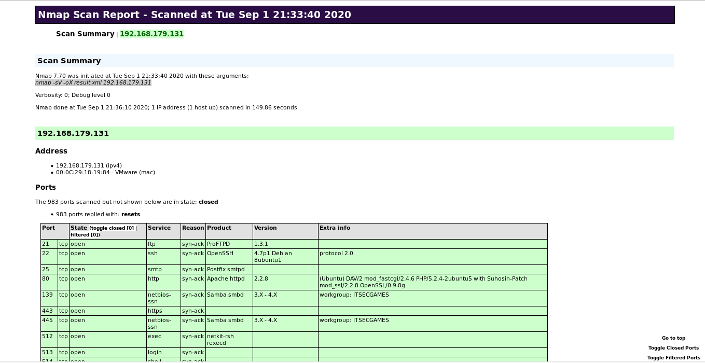


### 옵션

- -sV : 서비스 버전 정보 표시
- -sC : 스크립트 정보 표시 (호스트 내부 정보 표시)
- -oX [~.xml] : 결과값을 xml 파일로 출력
- -p1-[포트번호] : 해당 범위의 포트까지 검색, 개발자가 개인 용도로 열어둔 포트 확인이 가능하다


## nmap NSE - Nmap Script Engine

- lua라는 프로그램으로 만들어져 있다.
- 공격코드를 포함하며 특정 취약점 공격할수 있다
- nmap NSE Library

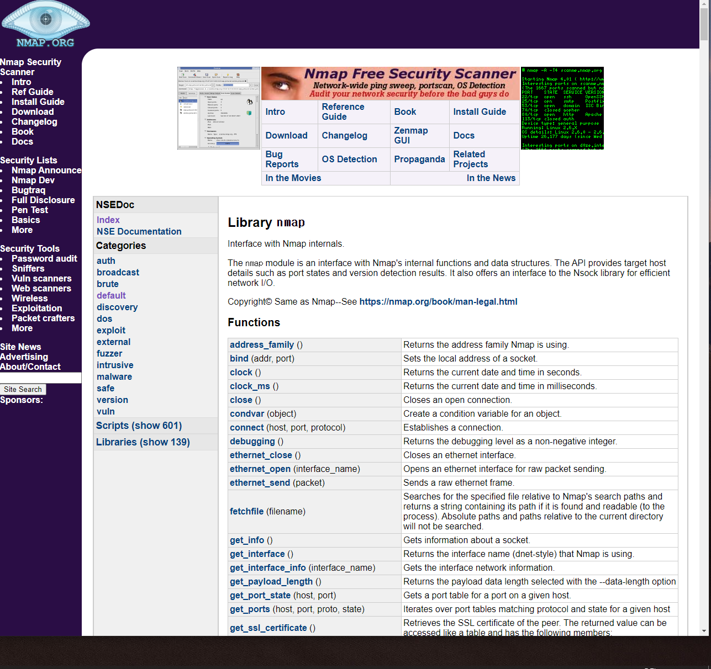


- 여러 스크립트를 제공하여 각 항목별로 공격/점검 이 가능하다

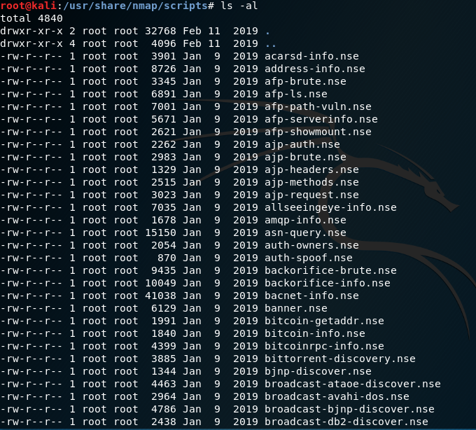


- 예시) html 타이틀 확인

  ```bash
  $ nmap --script=http-title [IP] -p80
  ```

  

## SPARTA : 웹 취약점 분석 도구

- nmap, nikto, screenshot을 동시에 포함하는 도구
- 스파르타 실행

```bash
$ sparta
```

- 호스트 scope 추가 후 스캔

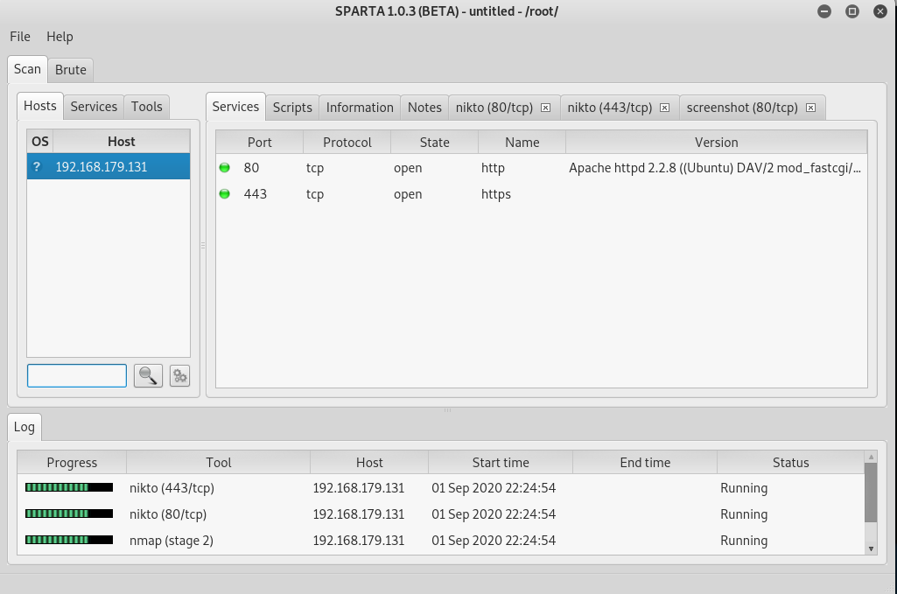


## 검사 방법,순서 및 툴

- 기본적으로 디렉터리 검사, 파일검사 이후에 버전검사, 설치정보 검사가 이루어져야 한다
- 디렉터리/파일 검사
  - 스파이더(Spider)
    - 링크된 페이지를 크롤링하며 진단
    - 연결된 모든 페이지(외부에 노출된 페이지)를 1회 방문한다
    - 장애 요소는 많지 않음
    - 취약점
      - 관리자 페이지에 대한 접근제어 확인
      - 디렉터리 리스팅 취약점 검사(Index of 취약점)
      - 버전정보 노출 여부
    - 장애요소
      - 게시물의 submit 페이지 (게시물 작성을 통해 확인)
- 강제 디렉터리 검사(Forced)
  - 가지고있는사전파일(Dictionary File)을 각각 대입
  - 백업파일 (zip, bak, ...)을 찾아냄 ex) test.zip, admin.zip
  - 취약점
    - 관리자 페이지 검색
    - index of 취약점
    - 백업파일
    - 인증처리 미흡 확인


## 수동적 공격과 공격적 공격 (Passive Attack vs Active Attack)

- 수동적 공격(취약점) - Passive Attack

  - 공격코드 없이 나타나는 취약점 분석

- 공격적 공격(취약점) - Active Attack

  - 공격코드를 이용해 공격시 일어나는 오류를 통해 나타는 취약점 분석

  

## OWASP-ZAP(Zed Attack Proxy)

- 프록시를 통한 웹 보안 점검 툴


## burp suite를 통한 쇼핑몰 페이지 점검

- admin 페이지 점검

- input값에 대한 암호화 여부

  - 관리자페이지 접근 제어 여부
  - ssl 통신 여부 (https)

  - 비 암호화 통신 여부 확인

- 예측하기 쉬운 계정정보

- SQLi, XSS 입력값 검증 미흡 여부

- 인증처리되지 않은 페이지 검색


### 로그인 ID PW 공격 - burp suite intruder 이용

- 로그인 창에 아무 값 넣은 후 패킷을 잡는다
- 잡은 패킷을 우클릭후 **"send to intruder"**
- 아래와 같은 페이지가 나온다

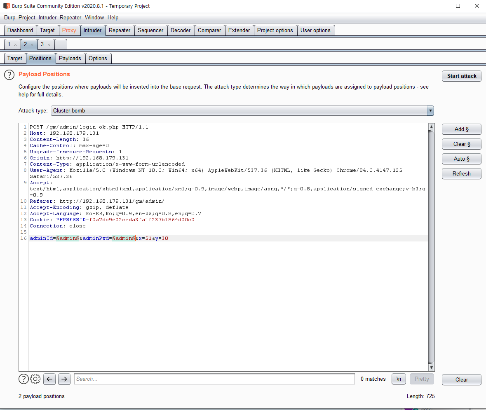

1. Attack type을 Cluster bomb으로 설정 (sinper는 한개의 위치에 넣는 경우, Cluster bomb은 여러위치)
2. clear를 눌러 auto로 설정된 값들을 제거
3. 대입할 값들이 들어갈 곳을 블록 후 add (여기서는 ID와 PW의 입력값 부분이 된다)


- payload 탭을 클릭한다
- 

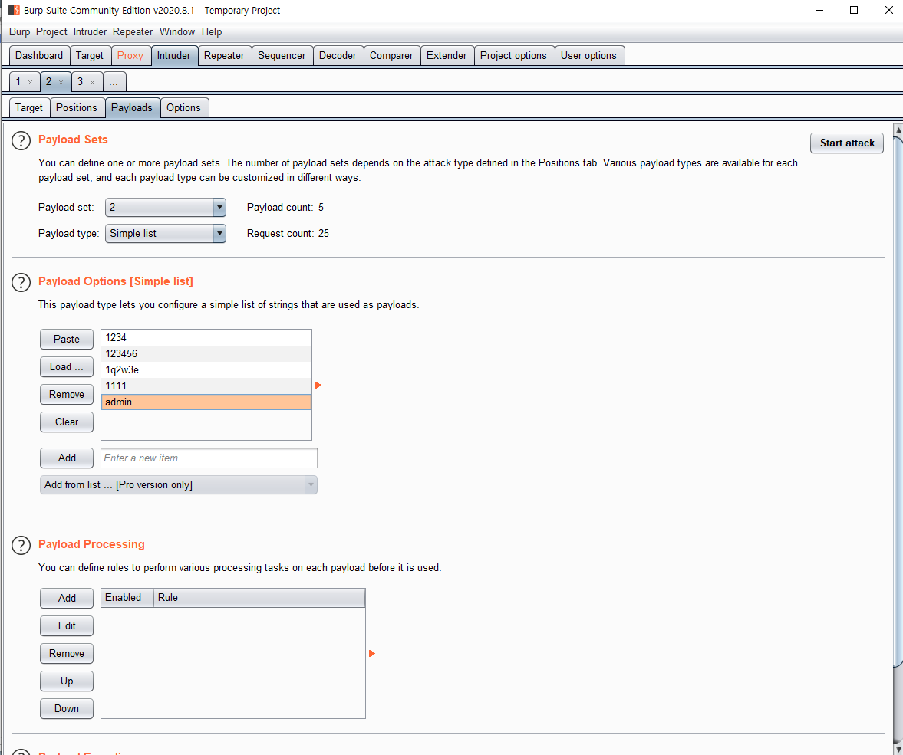


- 현재 ID와 PW 입력값 위치 두개의 Payload가 존재한다
- Payload set 1의 Payload Option에 ID에 넣을 값을 add
- Payload set 2의 Payload Option에 PW에 넣을 값을 add

- Payload type을 Simple list로 설정

- Start Attack


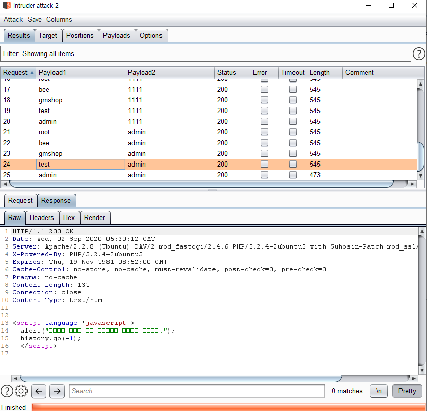

- 위와같이 입력된 리스트의 모든 조합으로 값을 넣는다
- 패킷 길이의 변화를 통해 성공 여부를 판단하는 것이 가능하다


### 만약 성공시에도 패킷 길이가 같다면?

- 공격 결과에 대한 Response를 확인한다

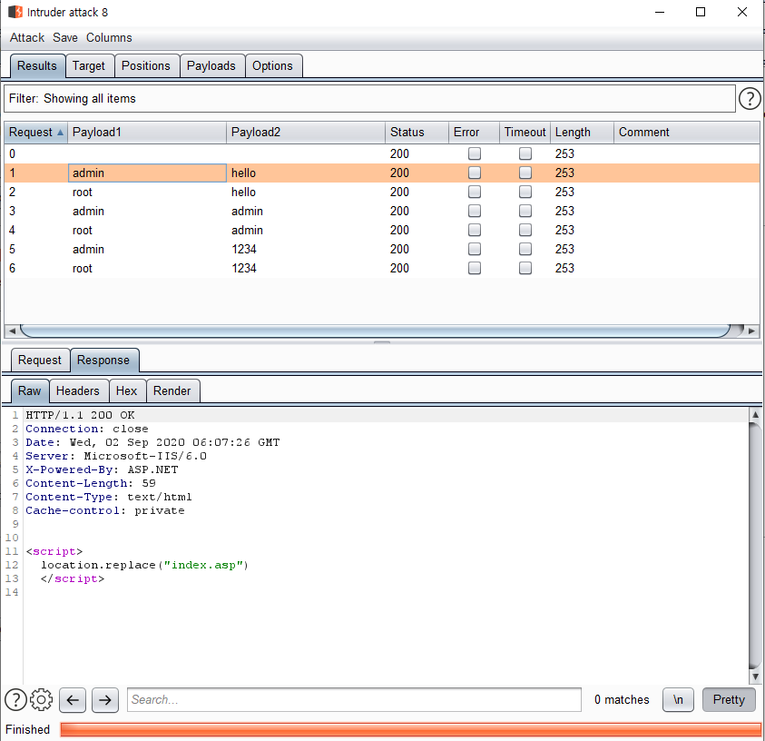


```asp
<script>
    loaction.replace("index.asp")
</script>
```

- 위 부분을 통해 로그인 성공시 "index.asp" 대신 다른 곳으로 페이지가 이동될 것을 알 수 있다.
- 길이가 같을 경우 이부분의 글자수가 같아서 임을 추론할 수 있다.


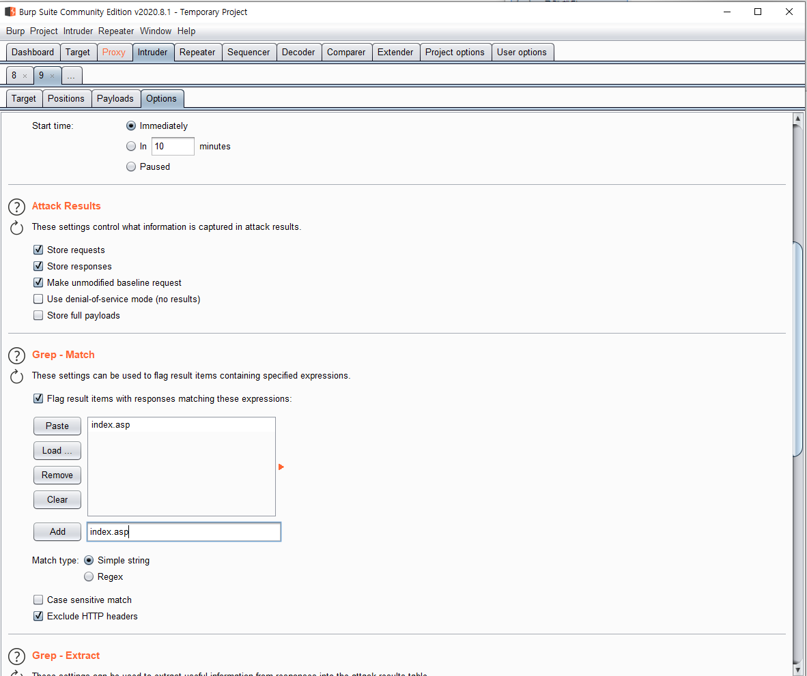


- Intruder의 Option에서 **Grep-Match**를 확인한다
- 기존의 내용을 clear해서 지운다
- 방금전 확인한 index.asp를 add 한다
- 다시 공격을 실행한다


- index.asp가 포함되지 않은 조합을 확인 가능하다
- 해당 조합의 Response를 보면 **admin.asp** 로 가는것을 확인 가능하다


### 참고

- seclist : https://github.com/danielmiessler/SecLists   // 검사할 값들을 모아둔 리스트


## AstroGrep - 코드 패턴 분석/검색 (인증처리 미흡 페이지 검색)


- 코드에서 인증을 담당하는 부분을 찾아낸다

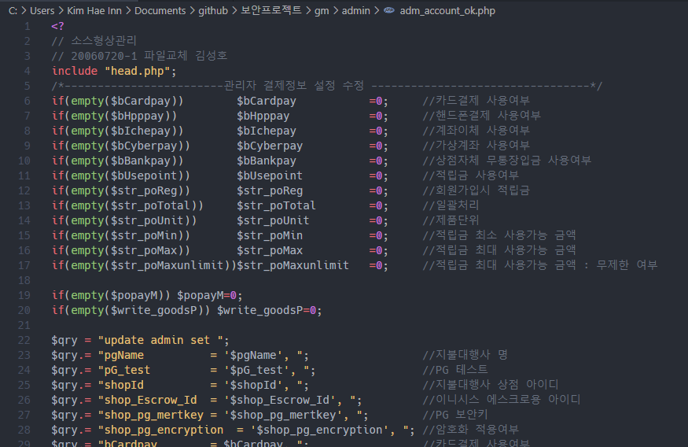

- "head.php"가 포함되는것을 확인 가능하다


- head.php의 내용물은 다음과 같다

- 인증이 필요한 페이지에 head.php가 포함됨을 알 수 있다


- AstroGrep을 사용할 경우 해당 문자열을 포함하는 혹은 포함하지 않는 파일을 분류할 수 있다
- 이를 기준으로 점검이 가능해진다


## 회원가입 인증 항목 건너뛰기 - Burp Suite 사용


### 옵션 설정

- 사용시 Proxy 설정에서 Response에 대한 설정이 되어있어야 한다

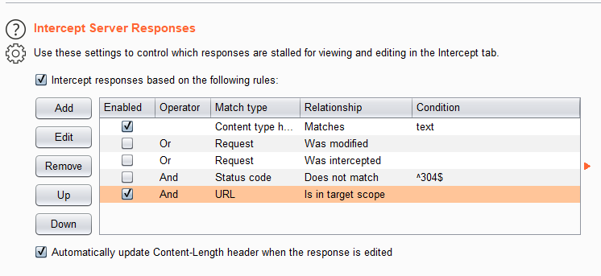

- 설정은 위와 같다


### Javascript에서 건너뛸 부분 지우기

- form을 통해서 인풋값을 전달하는데 이를 다루는 부분을 지워야 한다.

- **회원가입** 버튼을 눌러 가입 페이지에 대한 GET 신호를 인터셉트한다.
- Forward 하면 이에대한 Response로 페이지를 반환받게 된다. 아래와 같이 나타난다.

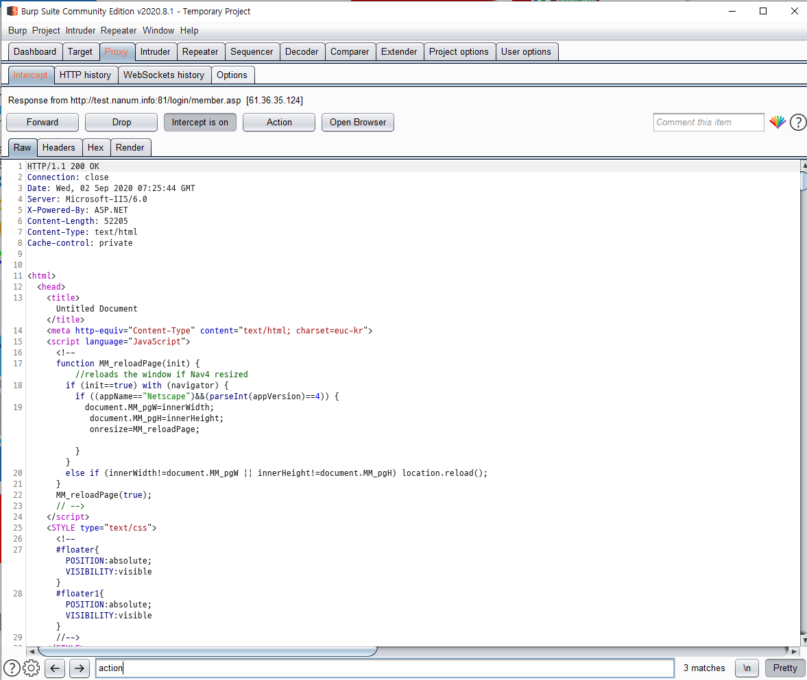

- 위의 코드에서 회원가입에 대한 개인 정보를 처리하는 부분을 삭제한다


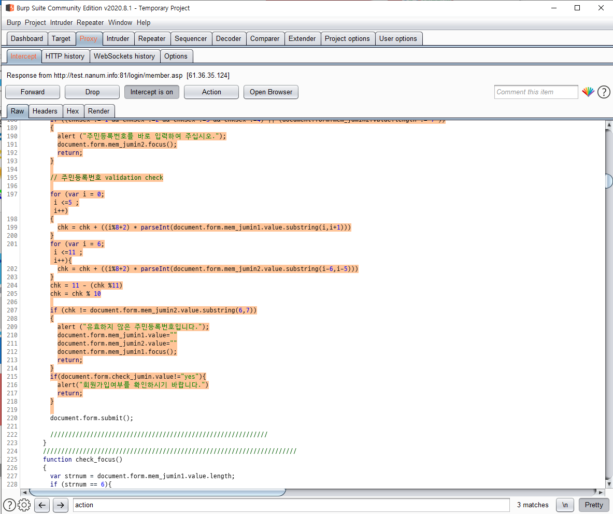

- 마지막의 submit 함수는 양식을 제출하는 함수이므로 남겨둔다
- 결과적으로 받은 값 없이 submit시킬수 있게 되는 것이다.

- 해당 상태로 forword 시킨다

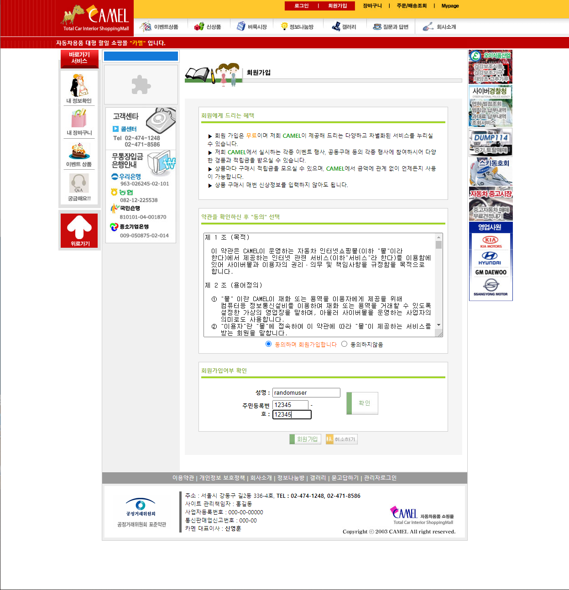

- 기존 페이지와 달라진것 없지만 값에 대한 검증 없이 다음 페이지로 넘어가는 것이 가능하다

- 다음 페이지 또한 동일한 방법으로 진행한다

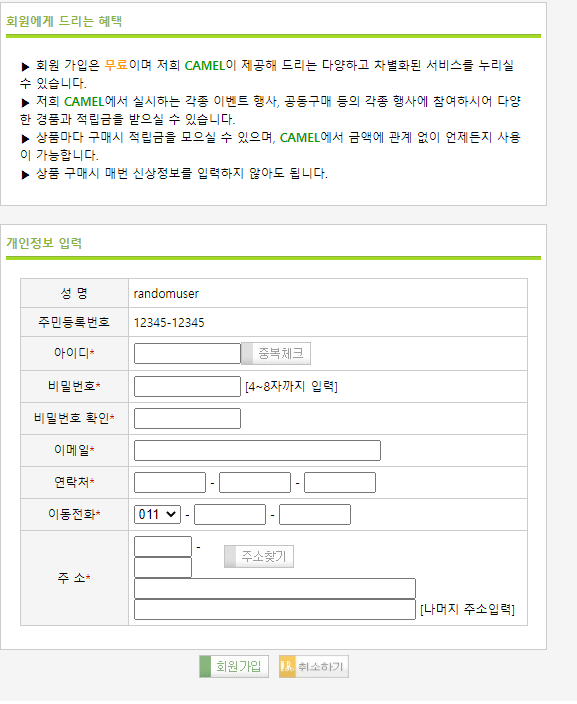


- 양식 전달부분만을 남기고 모두 삭제한다

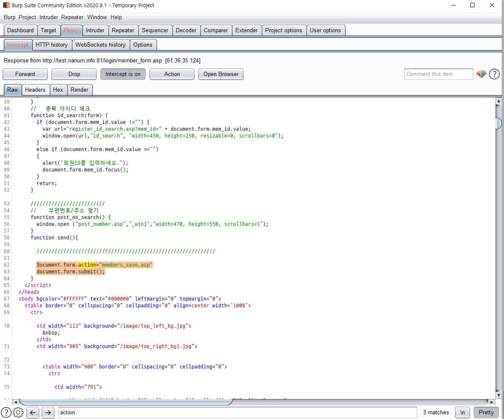


- 이후 폼을 채우고 로그인을 하면


- 로그인이 됨을 확인할 수 있다


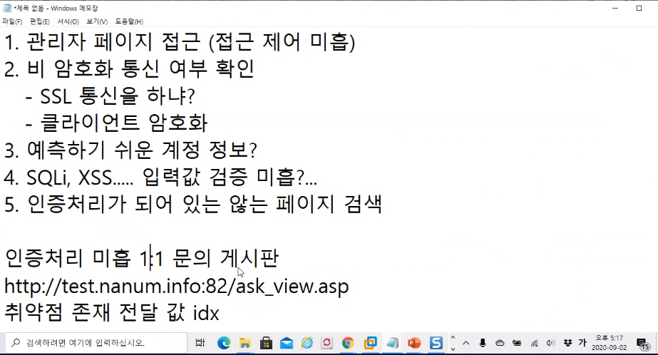